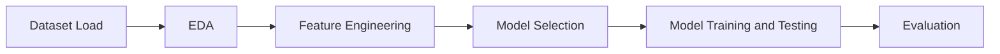

# STKI-A11.2022.14626-UAS

## 1. Project STKI: Analisis Harga Mobil BMW
### Identitas Lengkap
- Nama: Akhmad Haris
- Nim: A11.2022.14626
- Kelompok: A11.4517

## 2. Ringkasan dan Permasalahan Project

### Ringkasan
Proyek ini bertujuan untuk memprediksi harga mobil BMW berdasarkan beberapa fitur seperti tahun,model, jarak tempuh, pajak, mpg, dan ukuran mesin. Model ini diharapkan dapat memberikan estimasi harga mobil yang akurat sehingga dapat membantu dalam pengambilan keputusan untuk pembelian atau penjualan mobil.

### Permasalahan
Bagaimana cara memprediksi harga mobil dengan menggunakan dataset yang berisi informasi mengenai fitur-fitur mobil?

### Tujuan
Membangun model yang mampu memprediksi harga mobil dengan akurasi tinggi.

### Model / Alur Penyelesaian:

## 3. Penjelasan Dataset, EDA, dan Proses Features Dataset

### Dataset
Dataset yang digunakan adalah dataset harga mobil BMW yang berisi informasi tentang harga mobil dan beberapa fitur seperti tahun, jarak tempuh, pajak, mpg, ukuran mesin, dan model mobil.

### Exploratory Data Analysis (EDA)
Lakukan EDA untuk memahami data secara lebih mendalam. Beberapa hal yang bisa dilakukan antara lain:
- Descriptive statistics
- Data visualization
- Identifikasi missing values
- Analisis distribusi data

## 4. Proses Learning / Modeling

Jelaskan proses pemodelan yang dilakukan. Beberapa hal yang bisa dijelaskan antara lain:
- Pemilihan model
- Training dan validation
- Hyperparameter tuning
- Cross-validation

## 6.Diskusi Hasil dan Kesimpulan

### Diskusi Hasil
- **Linear Regression**: Model ini memberikan hasil yang cukup baik, namun kurang mampu menangani non-linearitas dalam data.
- **Random Forest**: Model ini menunjukkan performa yang sangat baik dengan R² yang tinggi, menunjukkan kemampuan yang baik dalam menangani data yang kompleks.
- **Gradient Boosting**: Model ini juga memberikan performa yang baik, sedikit lebih baik dari Linear Regression namun masih di bawah Random Forest dalam hal akurasi prediksi.

### Kesimpulan
Berdasarkan hasil evaluasi, model Random Forest adalah yang terbaik untuk prediksi harga mobil bekas BMW dalam dataset ini, diikuti oleh Gradient Boosting dan Linear Regression. Langkah selanjutnya bisa termasuk lebih banyak tuning hyperparameter untuk model Random Forest atau mencoba model-model lain yang lebih canggih untuk peningkatan akurasi lebih lanjut.
